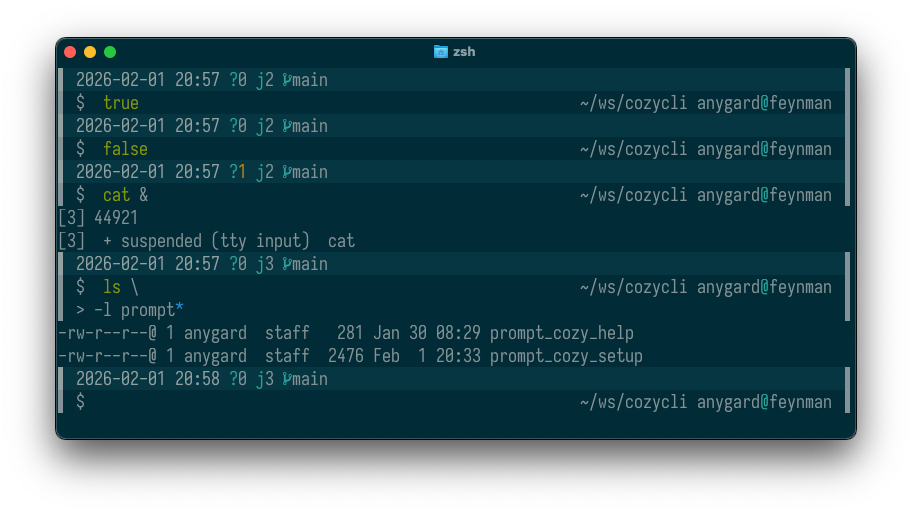

# Cozy - a zsh prompt

This is a zsh prompt made from scratch only utilizing native zsh functionality
no frameworks or anything. It aims to be understated and subtle. It uses
vertical features on the left and right to visally tie prompt and command
line(s) together and  contrast them with all the other lines, the output from
all the programs.  



## Installation

```
fpath+="<path to prompt dir (this dir)>"
autoload -Uz promptinit && promptinit
prompt cozy
```

## Color theme

The prompt is designed for use with a solarized dark palette. My terminal
emulator of choice [Ghostty](http://ghostty.org) includes several variants of
the Solarized Dark theme. One of them followed the original palette pretty
closely but for reasons I don't understand nor agree with colors 0 and 8 have
have strange values. In the theme directory is a patched 'Builtin Solarized
Dark' theme file the more closely follow [Ethan
Schoonovers](https://ethanschoonover.com/solarized/) vision.


## Background

This is a port of a prompt I created for bash. The look differs a little from
the bash version due to the fact that I did not succeed in combining
non-default background color on the command line with features like auto
suggest and syntax highlighting. The bash prompt 

